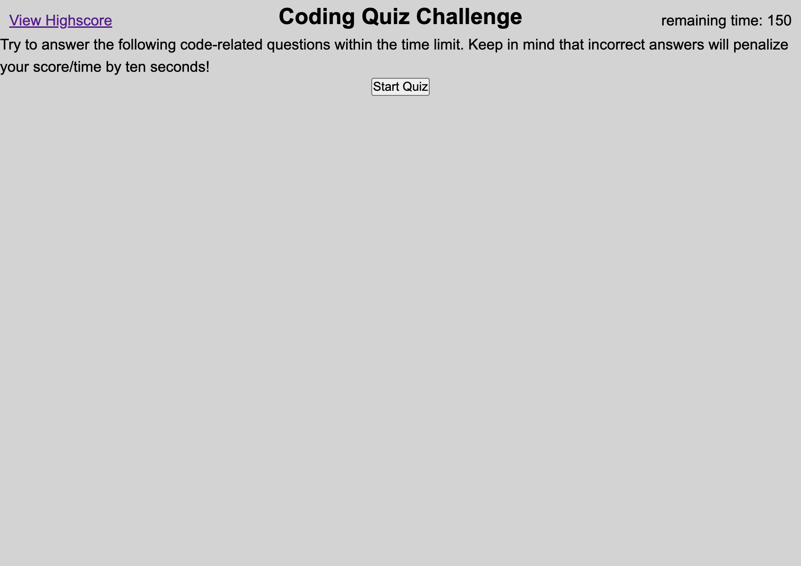

# WebAPIs-code-quiz

## Description
This webpage was creatated as a study word quiz. As you're taking the quiz you have a timer that shortens everytime you get a wrong answer. After you're finished the loads and asks you for your name to store the score. The page holds a record of the high scores for future use. 

## Links

- [Live](https://tlequernaque.github.io/WebAPIs-code-quiz/)

## Screenshots

## Available Commands

N/A

## Built With

- HTML
- CSS
- JavaScript

## Future Updates

- N/A

## Author

**Terry Lequernaque**

- [Email](mailto:t.lequernaque@yahoo.com?subject=Hi "Hi!")

## 🤝 Support

Contributions, issues, and feature requests are welcome!

Give a ⭐️ if you like this project!